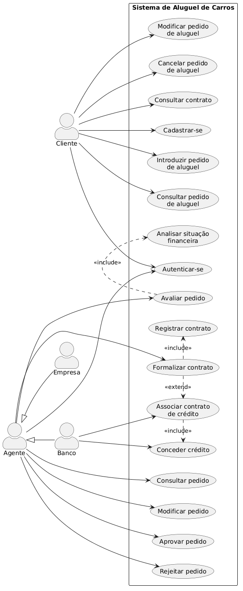
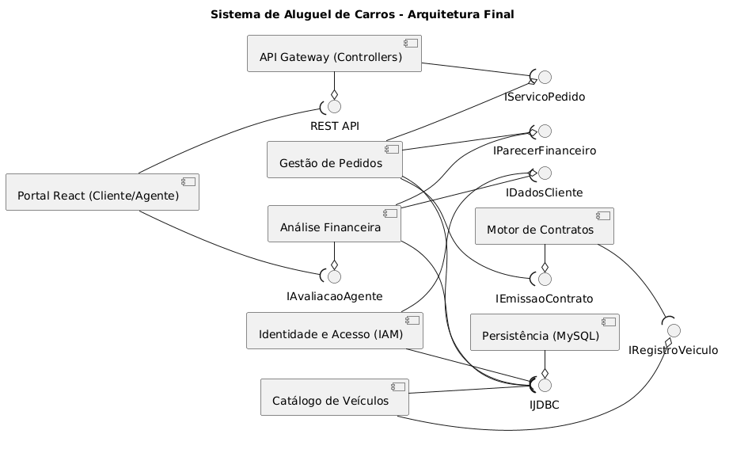
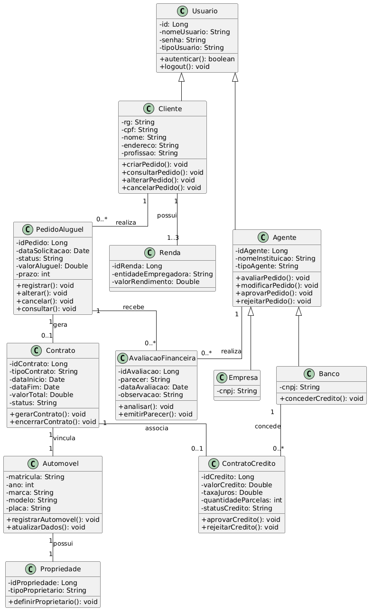
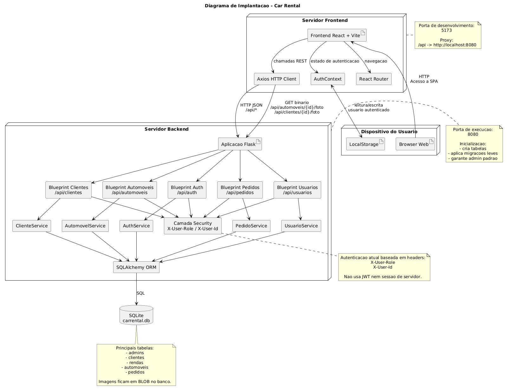
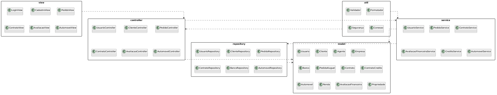

# 🚗 Car Rental Lab 02 - Sistema de Aluguel e Compra de Automóveis

> Uma aplicação web full stack desenvolvida como projeto da disciplina de Laboratório de Desenvolvimento de Software, permitindo cadastro de usuários, publicação de anúncios de carros, criação e gestão de pedidos de aluguel/compra, notificações e administração do sistema.

Este projeto demonstra a construção de uma aplicação web moderna com **frontend em React + Vite**, **backend em Flask**, **persistência com SQLAlchemy** e **armazenamento de imagens em banco de dados**, incluindo autenticação por perfil, regras de negócio para pedidos e interface responsiva.

---

## 🚧 Status do Projeto


---

## 📚 Índice

- [🔗 Links Úteis](#-links-úteis)
- [📝 Sobre o Projeto](#-sobre-o-projeto)
- [✨ Funcionalidades Principais](#-funcionalidades-principais)
- [🛠 Tecnologias Utilizadas](#-tecnologias-utilizadas)
- [🏗 Arquitetura](#-arquitetura)
- [🔧 Instalação e Execução](#-instalação-e-execução)
- [📂 Estrutura de Pastas](#-estrutura-de-pastas)
- [🎥 Demonstração](#-demonstração)
- [🧩 Diagramas e Documentação](#-diagramas-e-documentação)
- [🔗 Documentações Utilizadas](#-documentações-utilizadas)
- [👥 Autores](#-autores)
- [🤝 Contribuição](#-contribuição)
- [🙏 Agradecimentos](#-agradecimentos)
- [📄 Licença](#-licença)

---

## 🔗 Links Úteis

🐙 **Repositório:** [github.com/felipegiannetti/car-rental-lab02](https://github.com/felipegiannetti/car-rental-lab02)
> Código-fonte completo do projeto

📄 **Histórias de Usuário:** [docs/historiadeusuarios.pdf](docs/historiadeusuarios.pdf)
> Documento acadêmico com o levantamento funcional do sistema

🧩 **Diagramas:** [diagramas/](diagramas)
> Pasta com diagramas de casos de uso, classes, componentes, implantação e pacotes

🔐 **Conta Administrativa Padrão:**
> `login: admin`  
> `senha: admin`

---

## 📝 Sobre o Projeto

### 🎯 Propósito

Este projeto foi desenvolvido como trabalho prático da disciplina de **Laboratório de Desenvolvimento de Software** do curso de **Engenharia de Software**, com o objetivo de construir um sistema web de anúncios de automóveis que suporte:

- cadastro e autenticação de usuários
- publicação de carros com imagem salva em banco
- pedidos de **aluguel** e **compra**
- aprovação e recusa de pedidos pelo dono do anúncio
- notificações de resposta ao solicitante
- área administrativa para gerenciamento de usuários e operações do sistema

### 🎓 Contexto Acadêmico

- **Disciplina:** Laboratório de Desenvolvimento de Software
- **Instituição:** PUC Minas - Engenharia de Software
- **Período:** 4º Período
- **Semestre:** 2026/1

---

## ✨ Funcionalidades Principais

- 🏠 **Home Pública:** visitantes acessam a listagem de carros sem necessidade de login
- 📝 **Cadastro de Clientes:** registro de usuário com dados pessoais, profissão e rendas
- 🔐 **Autenticação por Perfil:** diferenciação entre **ADMIN** e **CLIENTE**
- 🚘 **Anúncios de Carros:** clientes autenticados podem publicar, editar e excluir seus próprios anúncios
- 🖼 **Imagens em Banco:** fotos dos carros são armazenadas em bytes no banco de dados, sem salvar localmente
- 🧭 **Listagem em Cards:** visualização dos carros em cards com foco na foto e filtros avançados
- 🔎 **Filtros de Busca:** filtragem por marca, quilometragem máxima, ano e modalidade
- 🛒 **Pedidos de Compra e Aluguel:** o solicitante escolhe o tipo de pedido ao interagir com o anúncio
- 📅 **Controle de Conflito de Datas:** aluguel só é aceito em períodos livres
- 🤝 **Fluxo de Aprovação:** o dono do anúncio aprova ou recusa pedidos recebidos
- 📬 **Notificações Paginadas:** aprovações e recusas visíveis ao solicitante, com 5 notificações por página
- 📞 **Liberação de Contato em Compra:** ao aprovar compra, o sistema envia nome, email e telefone do anunciante ao comprador
- 📂 **Meus Anúncios:** página dedicada para visualizar e gerenciar apenas os carros publicados pelo usuário
- 🧾 **Pedidos Recebidos:** página específica para analisar solicitações ligadas aos próprios anúncios
- 👥 **Administração de Usuários:** admins podem criar, editar, visualizar e deletar usuários
- 🛠 **Administração Global:** admin pode excluir pedidos e anúncios do sistema

---

## 🛠 Tecnologias Utilizadas

### 💻 Front-end

| Tecnologia | Versão | Uso |
|---|---|---|
| **React** | 18.2.0 | Construção da interface SPA |
| **Vite** | 5.1.5 | Build tool, dev server e HMR |
| **React Router DOM** | 6.22.3 | Roteamento do frontend |
| **Axios** | 1.6.7 | Comunicação HTTP com a API |
| **React Hook Form** | 7.51.0 | Gerenciamento de formulários |
| **React Hot Toast** | 2.4.1 | Feedback visual de ações |
| **Lucide React** | 0.344.0 | Ícones da interface |
| **Tailwind CSS** | 3.4.1 | Estilização responsiva |

### ⚙️ Back-end

| Tecnologia | Versão | Uso |
|---|---|---|
| **Flask** | 3.x | Framework web da API |
| **Flask-Cors** | 4.x | Liberação de CORS para `/api/*` |
| **Flask-SQLAlchemy** | 3.1.1+ | Integração ORM com Flask |
| **SQLAlchemy** | 2.x | Modelagem e acesso ao banco |
| **Werkzeug** | 3.x | Hash de senha e utilidades web |
| **python-dotenv** | 1.0.1+ | Variáveis de ambiente |
| **PyMySQL** | 1.1.1+ | Driver opcional para MySQL |

### 🗄 Banco de Dados

| Tecnologia | Uso |
|---|---|
| **SQLite** | Banco padrão do projeto em desenvolvimento |
| **BLOB** | Armazenamento das imagens dos carros e clientes |

### ☁️ Infraestrutura & Ferramentas

| Ferramenta | Uso |
|---|---|
| **Git** | Versionamento |
| **GitHub** | Hospedagem do repositório |
| **Node.js** | Execução do frontend |
| **Python** | Execução do backend |

---

## 🏗 Arquitetura

### 📐 Visão Geral

O projeto segue uma arquitetura web em camadas:

```text
┌──────────────────────────────────────────────┐
│              Navegador do Usuário            │
└──────────────────────────────────────────────┘
                     │
                     ▼
┌──────────────────────────────────────────────┐
│         Frontend React + Vite (SPA)          │
│  - React Router                              │
│  - AuthContext                               │
│  - Axios                                     │
└──────────────────────────────────────────────┘
                     │ HTTP / JSON
                     ▼
┌──────────────────────────────────────────────┐
│             Backend Flask (API)              │
│  - Auth Blueprint                            │
│  - Cliente Blueprint                         │
│  - Automovel Blueprint                       │
│  - Pedido Blueprint                          │
│  - Usuario Blueprint                         │
│  - Camada de Services                        │
│  - Security baseada em headers               │
└──────────────────────────────────────────────┘
                     │ SQLAlchemy ORM
                     ▼
┌──────────────────────────────────────────────┐
│              SQLite / Banco Local            │
│  - admins                                    │
│  - clientes                                  │
│  - rendas                                    │
│  - automoveis                                │
│  - pedidos                                   │
└──────────────────────────────────────────────┘
```

### 🧱 Comunicação Entre as Camadas

- O **frontend** chama a API usando `Axios` com `baseURL: /api`
- Em desenvolvimento, o **Vite** faz proxy de `/api` para `http://localhost:8080`
- O **backend Flask** recebe as requisições REST, valida permissões e delega para a camada de serviços
- A camada de **services** encapsula as regras de negócio
- O **SQLAlchemy** persiste e consulta os dados no banco
- As imagens dos carros são enviadas em base64 pelo frontend, convertidas para bytes no backend e salvas no banco como **BLOB**

### 🔐 Estratégia de Autenticação

- O sistema atual **não usa JWT**
- Após login, o frontend salva o usuário autenticado no `localStorage`
- A cada request, o frontend envia:
  - `X-User-Role`
  - `X-User-Id`
- O backend usa esses headers para autorização em [backend/security.py](backend/security.py)

### 🧩 Módulos Principais do Backend

| Módulo | Responsabilidade |
|---|---|
| **Auth** | login e bootstrap do admin padrão |
| **Cliente** | cadastro e manutenção de clientes |
| **Automóvel** | publicação, edição, exclusão e exibição de anúncios |
| **Pedido** | criação, aprovação, recusa, cancelamento e exclusão de pedidos |
| **Usuário** | gestão administrativa de admins e clientes |

---

## 🔧 Instalação e Execução

### 📋 Pré-requisitos

Antes de começar, tenha instalado:

- **Python 3.9+**
- **Node.js 18+**
- **npm**
- **Git**

Verifique:

```bash
python --version
node --version
npm --version
```

---

### 1. Clone o repositório

```bash
git clone https://github.com/felipegiannetti/car-rental-lab02.git
cd car-rental-lab02
```

### 2. Instale as dependências do backend

```bash
python -m venv .venv
.venv\Scripts\activate
pip install -r backend/requirements.txt
```

### 3. Instale as dependências do frontend

```bash
cd frontend
npm install
cd ..
```

### 4. Execute o backend

```bash
python run.py
```

O backend ficará disponível em:

```text
http://localhost:8080
```

### 5. Execute o frontend

Em outro terminal:

```bash
cd frontend
npm run dev
```

O frontend ficará disponível em:

```text
http://localhost:5173
```

---

### 🗄 Configuração do Banco

Por padrão, o projeto usa:

```env
DATABASE_URL=sqlite:///carrental.db
```

Essa configuração está em [backend/config.py](backend/config.py).  
Se a variável `DATABASE_URL` não for definida, o SQLite local é utilizado automaticamente.

---

### 🔐 Credenciais Iniciais

Ao iniciar o backend, o sistema garante a criação do administrador padrão:

```text
login: admin
senha: admin
```

---

### 🏗 Build do Frontend

```bash
cd frontend
npm run build
```

Os arquivos otimizados serão gerados em:

```text
frontend/dist
```

### 🛠 Scripts Disponíveis

| Script | Comando | Descrição |
|---|---|---|
| Frontend Dev | `npm run dev` | Inicia o frontend com HMR |
| Frontend Build | `npm run build` | Gera build otimizado |
| Frontend Preview | `npm run preview` | Visualiza o build local |
| Backend Run | `python run.py` | Inicia a API Flask |

---

## 📂 Estrutura de Pastas

```text
car-rental-lab02/
├── backend/                   # API Flask
│   ├── admin/                 # Modelo de administrador
│   ├── auth/                  # Login e autenticação
│   ├── automovel/             # Regras e endpoints de anúncios
│   ├── cliente/               # Cadastro e manutenção de clientes
│   ├── pedido/                # Regras e endpoints de pedidos
│   ├── shared/                # Modelos compartilhados
│   ├── usuario/               # Gestão administrativa de usuários
│   ├── app.py                 # Criação da aplicação Flask
│   ├── config.py              # Configurações
│   ├── extensions.py          # Instância SQLAlchemy
│   ├── requirements.txt       # Dependências Python
│   └── security.py            # Autorização por headers
│
├── frontend/                  # Aplicação React + Vite
│   ├── src/
│   │   ├── api/               # Clientes HTTP
│   │   ├── components/        # Layout, Sidebar, modais etc.
│   │   ├── context/           # AuthContext
│   │   ├── pages/             # Telas do sistema
│   │   ├── App.jsx            # Rotas da SPA
│   │   └── main.jsx           # Entrada do React
│   ├── package.json
│   ├── vite.config.js
│   └── tailwind.config.js
│
├── diagramas/                 # Diagramas do projeto
├── docs/                      # Documentação complementar
├── instance/                  # Banco local SQLite gerado em runtime
├── run.py                     # Ponto de entrada do backend
├── pom.xml                    # Arquivo legado/acadêmico no repositório
└── README.md                  # Documentação principal
```

---

## 🎥 Demonstração

### 🌐 Principais Fluxos do Sistema

| Fluxo | Descrição |
|---|---|
| **Home pública** | Lista carros em cards sem exigir login |
| **Cadastro/Login** | Permite criação de cliente e autenticação de admin/cliente |
| **Publicação de anúncio** | Cliente publica carro com imagem, km e modalidades |
| **Meus anúncios** | Usuário visualiza e gerencia apenas seus próprios anúncios |
| **Pedidos recebidos** | Dono do carro aprova ou recusa pedidos dos seus anúncios |
| **Meus pedidos** | Solicitante acompanha pedidos feitos |
| **Notificações** | Exibe aprovações e recusas com paginação de 5 itens |
| **Administração** | Admin gerencia usuários, anúncios e pedidos globalmente |

---

## 🧩 Diagramas e Documentação

### 📌 Diagramas disponíveis no repositório

- 
- 
- 
- 
- 

### 📄 Documento adicional

- [História de Usuários](docs/historiadeusuarios.pdf)

---

## 🔗 Documentações Utilizadas

- 📖 [React Documentation](https://react.dev/)
- 📖 [Vite Documentation](https://vitejs.dev/)
- 📖 [Flask Documentation](https://flask.palletsprojects.com/)
- 📖 [SQLAlchemy Documentation](https://docs.sqlalchemy.org/)
- 📖 [Flask-SQLAlchemy Documentation](https://flask-sqlalchemy.palletsprojects.com/)
- 📖 [Tailwind CSS Documentation](https://tailwindcss.com/docs)
- 📖 [Axios Documentation](https://axios-http.com/)
- 📖 [React Router Documentation](https://reactrouter.com/)
- 📖 [React Hook Form Documentation](https://react-hook-form.com/)
- 📖 [Lucide Icons](https://lucide.dev/)
- 📖 [SQLite Documentation](https://www.sqlite.org/docs.html)

---

## 👥 Autores

| Nome | GitHub | Email |
|---|---|---|
| **Felipe Giannetti Fontenelle** | [@felipegiannetti](https://github.com/felipegiannetti) | felipegiannettifontenelle@gmail.com |

---

## 🤝 Contribuição

Contribuições são bem-vindas. Para colaborar:

1. Faça um **fork** do repositório
2. Crie uma branch para sua feature: `git checkout -b feat/minha-feature`
3. Faça commit das alterações: `git commit -m "feat: adiciona minha feature"`
4. Faça push para a branch: `git push origin feat/minha-feature`
5. Abra um **Pull Request**

### 📝 Sugestão de padrão de commits

| Prefixo | Uso |
|---|---|
| `feat:` | Nova funcionalidade |
| `fix:` | Correção de bug |
| `refactor:` | Refatoração sem alterar comportamento esperado |
| `docs:` | Alterações de documentação |
| `style:` | Ajustes visuais e formatação |
| `chore:` | Tarefas de manutenção |

---

## 🙏 Agradecimentos

- **PUC Minas** — pelo contexto acadêmico e desenvolvimento do projeto
- **Comunidade Flask** — pela documentação e ecossistema leve para APIs
- **Comunidade React** — pela base moderna de desenvolvimento frontend
- **Tailwind CSS** — pela produtividade na construção da interface
- **SQLAlchemy** — pela camada ORM utilizada no backend

---

## 📄 Licença

Este repositório **não possui um arquivo de licença definido até o momento**.

---

<div align="center">

**Desenvolvido por [Felipe Giannetti Fontenelle](https://github.com/felipegiannetti)**

🐙 GitHub: [github.com/felipegiannetti](https://github.com/felipegiannetti)  
📧 Email: [felipegiannettifontenelle@gmail.com](mailto:felipegiannettifontenelle@gmail.com)

</div>
